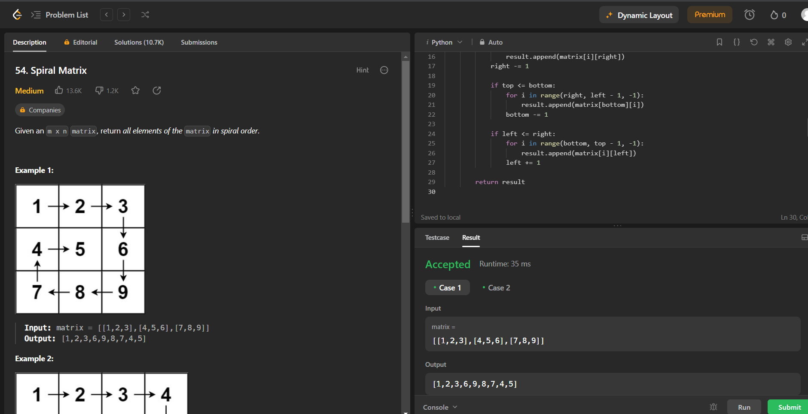

# Spiral Matrix
The Spiral Matrix problem takes a 2-Dimensional array of N-rows and M-columns as an input, and prints the elements of this matrix in spiral order. The spiral begins at the top left corner of the input matrix, and prints the elements it encounters, while looping towards the center of this matrix, in a clockwise manner.

## How to Run

1. Make sure you have a python compiler installed on your system.

2. Clone this repository to your local machine or download the `solution.py` file.

3. Open your terminal or command prompt.

4. Navigate to the directory where the `solution.py` file is located.

5. Compile the python code using your compiler.

6. Run the program by executing the generated executable:

7. The program will execute and display the result.

## Example Usage

Here's an example of how to use this program:

## Example 1:
Input: matrix = [[1,2,3],[4,5,6],[7,8,9]]

Output: [1,2,3,6,9,8,7,4,5]
```shell
$ python solution.py
Output:[1,2,3,6,9,8,7,4,5]
```

## screenshot


## Customization
You can easily customize the program to suit your needs. For example, you can modify the starting value of the spiral matrix, change the direction (e.g., counterclockwise), or format the output differently.

## Author
This program was written by Nawin Kumar Sharma. You can reach me at nawinsharma60@gmail.com for any questions or feedback.